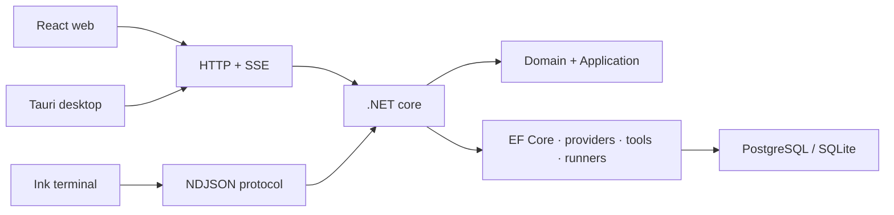

# Diwy — AI Orchestration Platform

### A public engineering case study for a private, production-oriented .NET product

[](https://dotnet.microsoft.com/) [](https://learn.microsoft.com/aspnet/core/) [](https://react.dev/) [](#verified-engineering-evidence)
[](https://github.com/Johan-Alvarez-Dev/diwy-ai-case-study/actions/workflows/ci.yml)

Diwy coordinates AI providers, external tools, visual artifacts, memory, and software-development workflows behind one reusable .NET core. Web, desktop, and terminal clients present the experience without reimplementing agent behavior.

> The production source remains private. This repository publishes architecture, trade-offs, sanitized contracts, and independently written samples that demonstrate the engineering approach without exposing proprietary logic or secrets.

[Open the live demo](https://diwy-ia.vercel.app/) · [Product tour](./docs/product-tour.md) · [Architecture](./docs/architecture.md) · [Code samples](./sample-code) · [Video](#video-walkthrough)

<picture>
  <source media="(prefers-color-scheme: dark)" srcset="./screenshots/diwy-home-dark-900.webp 900w, ./screenshots/diwy-home-dark-1600.webp 1600w">
  <source media="(prefers-color-scheme: light)" srcset="./screenshots/diwy-home-light-900.webp 900w, ./screenshots/diwy-home-light-1600.webp 1600w">
  
</picture>

## The problem

AI applications often couple their UI to one provider and treat a model-generated tool call as permission to execute. Diwy separates provider transport, application orchestration, authorization, and execution so that every client follows the same safety rules.

## My role

I designed and implemented the product across backend and frontend boundaries: .NET architecture, ASP.NET Core APIs, EF Core persistence, JWT authentication, provider adapters, tool authorization, workspace isolation, React state/data flows, and automated tests.

## Engineering highlights

- Clean Architecture with dependency direction enforced by project references.
- ASP.NET Core Identity, access JWTs, refresh-token sessions, and role policies.
- Provider-neutral contracts for messages, streaming, tools, and generation options.
- HTTP/SSE for web and desktop; NDJSON over stdio for the terminal client.
- `allow / ask / deny` authorization before tool execution.
- PostgreSQL for hosted scenarios and SQLite migrations for local clients.
- Encrypted provider credentials and publish rules that exclude local secrets.
- React 19, TanStack Query, Zustand, Zod, sandboxed artifacts, and five-language i18n.

## Architecture



See [architecture](./docs/architecture.md), [technical decisions](./docs/decisions.md), and the [engineering evidence map](./docs/engineering-evidence.md).

## Public code samples

| Sample | What it demonstrates |
| --- | --- |
| `ToolAuthorizationPolicy` | Fail-closed authorization, explicit consent, risk classification |
| `ToolExecutionAudit` | Immutable audit records and outcome classification |
| Tests | Boundary cases, case-insensitive deny rules, and deterministic behavior |

```bash
dotnet test tests/Diwy.PublicSample.Tests.csproj
```

Start with [ToolAuthorizationPolicy.cs](./sample-code/ToolAuthorizationPolicy.cs) and its [tests](./tests/ToolAuthorizationPolicyTests.cs).

## Verified engineering evidence

- 110 backend test files and 14 frontend test files in the private working repository.
- Tests cover authorization, command safety, workspaces, agents, provider streaming, encryption, storage, integrations, and CLI behavior.
- Publish configuration explicitly prevents local settings and workspace data from entering artifacts.
- API/provider contracts are isolated from client-specific presentation.

## Challenges addressed

1. Keeping one behavioral core across three different clients.
2. Mapping incompatible provider streaming/tool formats into stable internal contracts.
3. Preventing model output from bypassing human authorization.
4. Making file mutations reviewable and reversible.
5. Supporting hosted and local persistence without leaking platform concerns into the domain.

## Public vs. private

| Public here | Kept private |
| --- | --- |
| Architecture and ADR-style decisions | Production source and prompts |
| Reduced OpenAPI contract | Administrative endpoints and full schemas |
| Independent C# samples and tests | Credentials, customer data, telemetry |
| Security boundaries | Provider-specific operational configuration |

## Demo

[Open the Diwy demo](https://diwy-ia.vercel.app/). The deployed product demonstrates the user experience; this repository is the safe technical companion for architecture, security boundaries, and reviewable code.

Explore the theme-aware [product tour](./docs/product-tour.md) for the agent workspace, provider configuration, and account boundary.

## Video walkthrough

> **Coming soon.** A concise narrated tour of the agent workspace, provider selection, and tool-authorization flow is being recorded.

The repository reserves the [media area](./media/README.md) for the final video or optimized GIF.

## Roadmap

See the [public roadmap](./docs/roadmap.md). It describes engineering direction, not private delivery dates.

## License

The samples in this repository are MIT licensed. The private product is not covered by this license.
