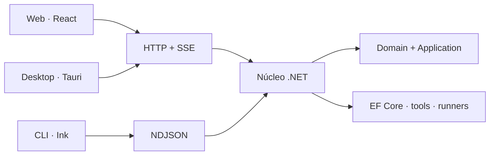

# Diwy

### Orquestación de IA, herramientas y agentes sobre un núcleo .NET

[](https://dotnet.microsoft.com/) [](https://react.dev/) [](./docs/architecture.md) [](#alcance-público)

Diwy reúne conversación con modelos, herramientas externas, artifacts, memoria y flujos de desarrollo asistido en una sola plataforma. Su reto central no es mostrar un chat: es coordinar proveedores y capacidades distintas sin duplicar lógica entre web, escritorio y terminal.

> Este repositorio contiene documentación, arquitectura, contratos y una muestra pública. El código principal permanece privado porque el producto continúa en desarrollo y operación.

## El problema

Las interfaces de IA suelen acoplar la experiencia a un proveedor y ejecutar herramientas sin una frontera clara de permisos. Diwy concentra esas decisiones en un núcleo .NET reutilizable y mantiene los clientes como capas de presentación finas.

## Mi responsabilidad

Diseño y desarrollo full-stack: arquitectura del núcleo, API ASP.NET Core, EF Core, autenticación JWT, integración de proveedores, herramientas, experiencia React y estrategia de pruebas.

## Capacidades demostradas

- Clean Architecture con dependencias hacia dominio y aplicación.
- ASP.NET Core Identity, JWT y refresh tokens.
- Contratos neutrales para varios proveedores de IA.
- Streaming HTTP/SSE y protocolo NDJSON para CLI.
- Motor de permisos `allow / deny / ask` y workspaces aislados.
- Cifrado de credenciales, PostgreSQL/SQLite e i18n en cinco idiomas.
- 110 archivos de pruebas backend y 14 suites frontend identificadas en el repositorio privado.

## Arquitectura



Consulta [arquitectura](./docs/architecture.md), [decisiones](./docs/decisions.md) y [roadmap](./docs/roadmap.md).

## Muestra pública

`ToolAuthorizationPolicy` modela una frontera independiente para autorizar herramientas según riesgo, autenticación y consentimiento explícito.

```bash
dotnet test tests/Diwy.PublicSample.Tests.csproj
```

Revisa el [código](./sample-code/ToolAuthorizationPolicy.cs), sus [pruebas](./tests/ToolAuthorizationPolicyTests.cs) y el [contrato público](./api/openapi.yaml).

## Demo

No hay una demo pública todavía: el modo demostración debe aislar herramientas, workspaces y proveedores antes de abrirse sin invitación.

## Evidencia visual

Las capturas se publicarán después de anonimizar conversaciones, rutas y cuentas. La guía está en [screenshots/README.md](./screenshots/README.md).

## Alcance público

| Público aquí | Permanece privado |
| --- | --- |
| Arquitectura y decisiones | Código principal y configuración |
| OpenAPI reducido | Endpoints administrativos y esquemas completos |
| Muestra C# y pruebas | Prompts, integraciones y datos reales |

## Seguridad y licencia

Consulta [SECURITY.md](./SECURITY.md). La [licencia MIT](./LICENSE) cubre solo esta muestra, no el producto privado.
