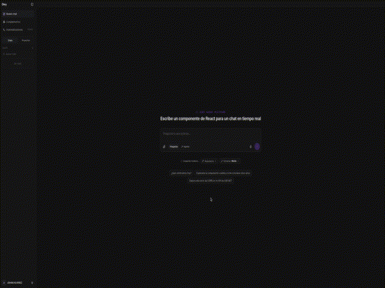
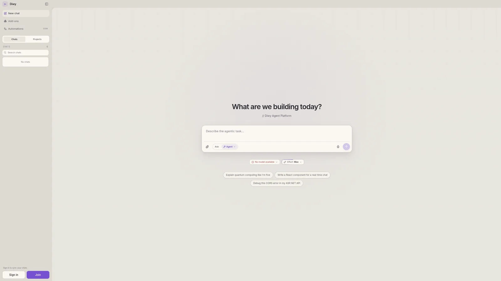
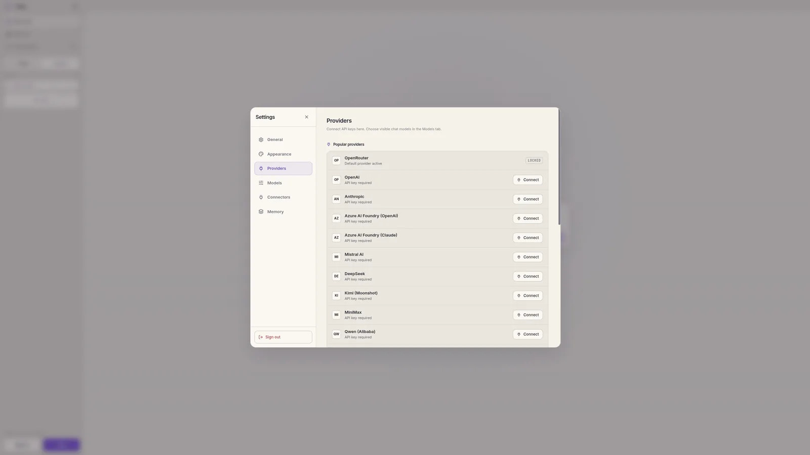
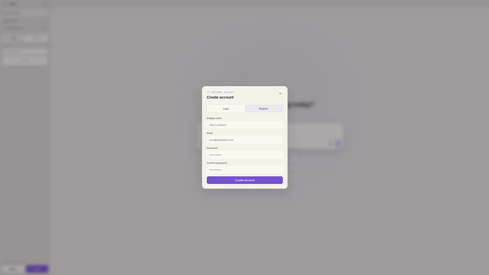

# Diwy product tour

These captures use synthetic guest content and switch automatically between light and dark screenshots when both themes are available. Open the [live demo](https://diwy-ia.vercel.app/) to explore the current interface.

## Quick walkthrough

The silent preview shows the agent workspace and provider controls without exposing authentication details.

  

## Agent workspace

The primary workspace keeps conversations, projects, model controls, and agent entry points in one surface.

<picture>
  <source media="(prefers-color-scheme: dark)" srcset="../screenshots/diwy-home-dark-900.webp 900w, ../screenshots/diwy-home-dark-1600.webp 1600w">
  <source media="(prefers-color-scheme: light)" srcset="../screenshots/diwy-home-light-900.webp 900w, ../screenshots/diwy-home-light-1600.webp 1600w">
  
</picture>

## Provider configuration

Provider choices remain separate from the orchestration core, allowing users to select capabilities without coupling the interface to one vendor.

<picture>
  <source media="(prefers-color-scheme: dark)" srcset="../screenshots/diwy-providers-dark-900.webp 900w, ../screenshots/diwy-providers-dark-1600.webp 1600w">
  <source media="(prefers-color-scheme: light)" srcset="../screenshots/diwy-providers-light-900.webp 900w, ../screenshots/diwy-providers-light-1600.webp 1600w">
  
</picture>

## Account boundary

Registration establishes the authenticated workspace boundary used for synchronized chats, projects, and provider settings.

<picture>
  <source media="(prefers-color-scheme: dark)" srcset="../screenshots/diwy-register-dark-900.webp 900w, ../screenshots/diwy-register-dark-1600.webp 1600w">
  <source media="(prefers-color-scheme: light)" srcset="../screenshots/diwy-register-light-900.webp 900w, ../screenshots/diwy-register-light-1600.webp 1600w">
  
</picture>

Return to the [case study](../README.md) or review the [architecture](./architecture.md).
